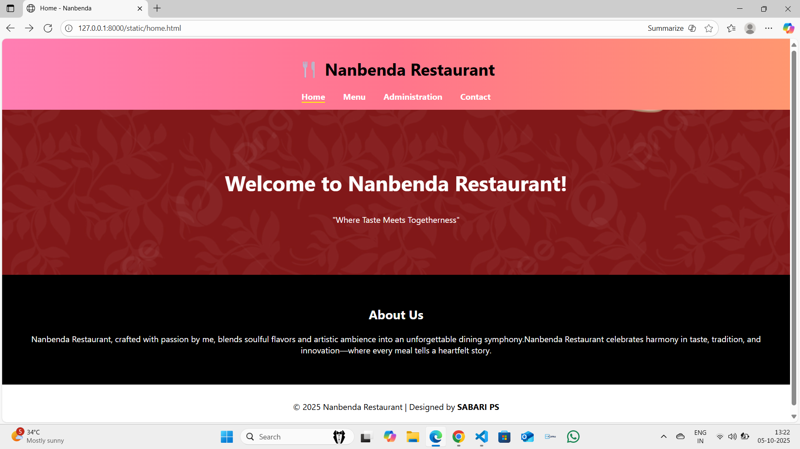
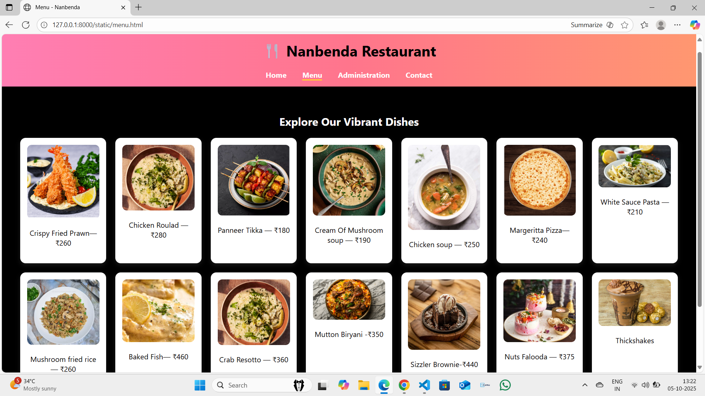
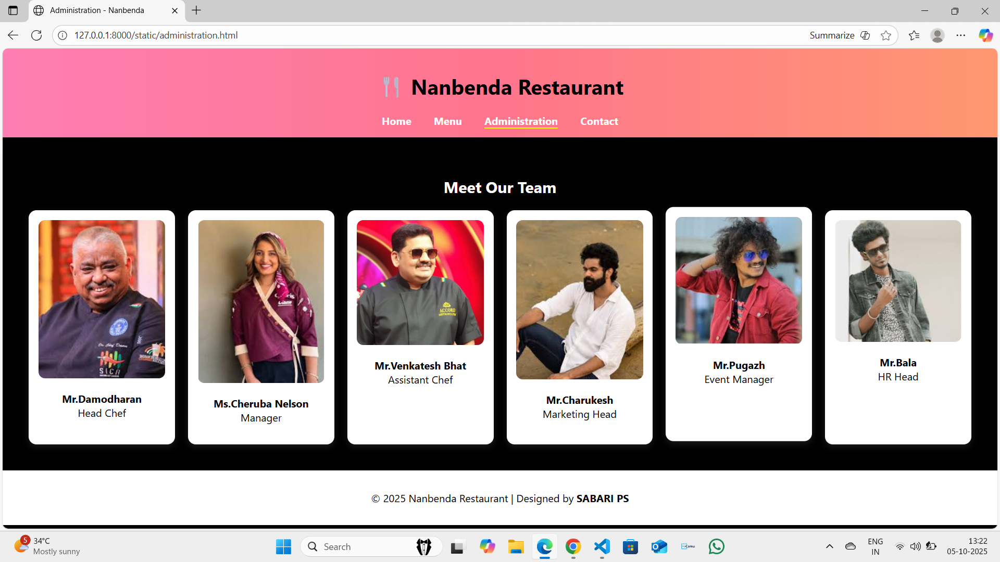
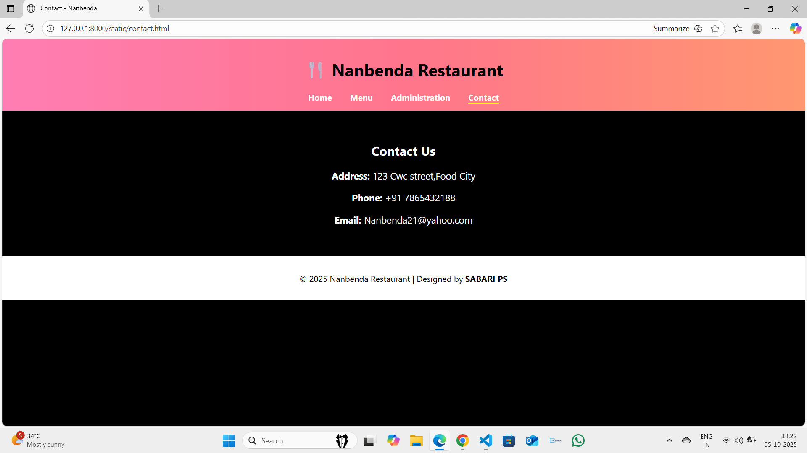

# Ex.07 Restaurant Website
# Date:5.10.2025
# AIM:
To develop a static Restaurant website to display the food items and services provided by them.

# DESIGN STEPS:
## Step 1:
Requirement collection.

## Step 2:
Creating the layout using HTML and CSS.

## Step 3:
Updating the sample content.

## Step 4:
Choose the appropriate style and color scheme.

## Step 5:
Validate the layout in various browsers.

## Step 6:
Validate the HTML code.

## Step 7:
Publish the website in the given URL.

# PROGRAM:
```
base.html:
<!DOCTYPE html>
<html lang="en">
<head>
  <meta charset="UTF-8">
  <title>{{ title }}</title>
  <link rel="stylesheet" href="style.css">
</head>
<body>
  <header>
    <h1>🍴 Nanbenda Restaurant</h1>
    <nav>
      <a href="home.html">Home</a>
      <a href="menu.html">Menu</a>
      <a href="administration.html">Administration</a>
      <a href="contact.html">Contact</a>
    </nav>
  </header>

  <main>
    {{ content }}
  </main>

  <footer>
    <p>© 2025 Nanbenda Restaurant | Designed by <b>SABARI PS</b></p>
  </footer>
</body>
</html>

home.html:
<!DOCTYPE html>
<html lang="en">
<head>
  <meta charset="UTF-8">
  <title>Home - Nanbenda</title>
  <link rel="stylesheet" href="style.css">
</head>
<body>
  <header>
    <h1>🍴 Nanbenda Restaurant</h1>
    <nav>
      <a href="home.html" class="active">Home</a>
      <a href="menu.html">Menu</a>
      <a href="administration.html">Administration</a>
      <a href="contact.html">Contact</a>
    </nav>
  </header>

  <section class="banner">
    <h2>Welcome to Nanbenda Restaurant!</h2>
    <p>"Where Taste Meets Togetherness"
    </p>
  </section>

  <section class="intro">
    <h2 style="color: white;">About Us</h2>
    <p style="color: white;">
    
    Nanbenda Restaurant, crafted with passion by me, blends soulful flavors and artistic ambience into an unforgettable dining symphony.Nanbenda Restaurant celebrates harmony in taste, tradition, and innovation—where every meal tells a heartfelt story.
    </p>
  </section>

  <footer>
    <p>© 2025 Nanbenda Restaurant | Designed by <b>SABARI PS</b></p>
  </footer>
</body>
</html>

menu.html:
<!DOCTYPE html>
<html lang="en">
<head>
  <meta charset="UTF-8">
  <title>Menu - Nanbenda</title>
  <link rel="stylesheet" href="style.css">
</head>
<body>
  <header>
    <h1>🍴 Nanbenda Restaurant</h1>
    <nav>
      <a href="home.html">Home</a>
      <a href="menu.html" class="active">Menu</a>
      <a href="administration.html">Administration</a>
      <a href="contact.html">Contact</a>
    </nav>
  </header>

  <section class="menu-grid">
    <h2 style="color: white;">Explore Our Vibrant Dishes</h2>
    <div class="grid">
      <div><p>Crispy Fried Prawn— ₹260</p>
</div>
      <div><p>Chicken Roulad — ₹280</p>
</div>
      <div><p>Panneer Tikka — ₹180</p>
</div>
      <div><p>Cream Of Mushroom soup — ₹190</p>
</div>
      <div><p>Chicken soup — ₹250</p>
</div>
      <div><p>Margeritta Pizza— ₹240</p>
</div>
      <div><p>White Sauce Pasta — ₹210</p>
</div>
      <div><p>Mushroom fried rice — ₹260</p>
</div>
      <div><p>Baked Fish— ₹460</p>
</div>
      <div><p>Crab Resotto — ₹360</p>
</div>
      <div><p>Mutton Biryani -₹350</p>
</div>
      <div><p>Sizzler Brownie-₹440</p>
</div>
      <div><p>Nuts Falooda — ₹375</p>
</div>
      <div><p>Thickshakes</p>
</div>
    </div>
  </section>

  <footer>
    <p>© 2025 Nanbenda Restaurant | Designed by <b>SABARI PS</b></p>
  </footer>
</body>
</html>

administration.html:
<!DOCTYPE html>
<html lang="en">
<head>
  <meta charset="UTF-8">
  <title>Administration - Nanbenda</title>
  <link rel="stylesheet" href="style.css">
</head>
<body>
  <header>
    <h1>🍴 Nanbenda Restaurant</h1>
    <nav>
      <a href="home.html">Home</a>
      <a href="menu.html">Menu</a>
      <a href="administration.html" class="active">Administration</a>
      <a href="contact.html">Contact</a>
    </nav>
  </header>

  <section class="admin-team">
    <h2 style="color: white;">Meet Our Team</h2>
    <div class="grid">
      <div><p><b>Mr.Damodharan</b><br>Head Chef</p></div>
      <div><p><b>Ms.Cheruba Nelson</b><br>Manager</p></div>
      <div><p><b>Mr.Venkatesh Bhat</b><br>Assistant Chef</p></div>
      <div><p><b>Mr.Charukesh</b><br>Marketing Head</p></div>
      <div><p><b>Mr.Pugazh</b><br>Event Manager</p></div>
      <div><p><b>Mr.Bala</b><br>HR Head</p></div>
    </div>
  </section>

  <footer>
    <p>© 2025 Nanbenda Restaurant | Designed by <b>SABARI PS</b></p>
  </footer>
</body>
</html>

contact.html:
<!DOCTYPE html>
<html lang="en">
<head>
  <meta charset="UTF-8">
  <title>Contact - Nanbenda</title>
  <link rel="stylesheet" href="style.css">
</head>
<body>
  <header>
    <h1>🍴 Nanbenda Restaurant</h1>
    <nav>
      <a href="home.html">Home</a>
      <a href="menu.html">Menu</a>
      <a href="administration.html">Administration</a>
      <a href="contact.html" class="active">Contact</a>
    </nav>
  </header>

  <section class="contact">
    <h2 style="color: white;">Contact Us</h2>
    <p style="color: white;"><b>Address:</b> 123 Cwc street,Food City</p>
    <p style="color: white;"><b>Phone:</b> +91 7865432188</p>
    <p style="color: white;"><b>Email:</b> Nanbenda21@yahoo.com</p>
  </section>

  <footer>
    <p>© 2025 Nanbenda  Restaurant | Designed by <b>SABARI PS</b></p>
  </footer>
</body>
</html>

style.css:
/* General */
body {
  margin: 0;
  font-family: 'Segoe UI', sans-serif;
  background: #000000;
  color: #040202;
}

/* Header */
header {
  background: linear-gradient(90deg, #e67e22, #ffb575, #ff9770);
  color: rgb(0, 0, 0);
  padding: 15px;
  text-align: center;
}

nav {
  margin-top: 10px;
}
nav a {
  color: rgb(255, 254, 254);
  text-decoration: none;
  margin: 0 15px;
  font-weight: bold;
}
nav a.active {
  border-bottom: 2px solid yellow;
}

/* Banner */
.banner {
  background: url(ground.png) no-repeat center/cover;
  color: rgb(255, 255, 255);
  padding: 80px 20px;
  text-align: center;
}
.banner h2 {
  font-size: 40px;
}

/* Sections */
section {
  padding: 40px;
  text-align: center;
}

/* Grid Layout */
.grid {
  display: grid;
  grid-template-columns: repeat(auto-fit, minmax(180px, 1fr));
  gap: 20px;
  margin-top: 20px;
}
.grid div {
  background: #ffffff;
  border-radius: 12px;
  box-shadow: 0 4px 10px rgba(255, 255, 255, 0.1);
  padding: 15px;
  transition: transform 0.3s;
}
.grid div:hover {
  transform: translateY(-5px);
}
.grid img {
  width: 100%;
  border-radius: 10px;
}

/* Contact */
.contact p {
  font-size: 18px;
}

/* Footer */
footer {
  background: #ffffff;
  color: rgb(1, 1, 1);
  text-align: center;
  padding: 15px;
}
```
# OUTPUT:





# RESULT:
The program for designing software company website using HTML and CSS is completed successfully.
